# RuoYi-Vue-Plus 模块快速生成器 - IDEA 插件开发知识点总结

## 1. IDEA 插件开发概述

IDEA 插件是基于 IntelliJ 平台开发的扩展程序，可以增强 IDEA 的功能，提高开发效率。开发 IDEA 插件需要理解 IntelliJ 平台的架构以及如何与之交互。

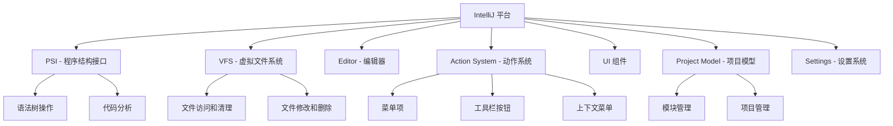

## 2. 插件开发基础结构

一个典型的 IDEA 插件包含以下核心组件：

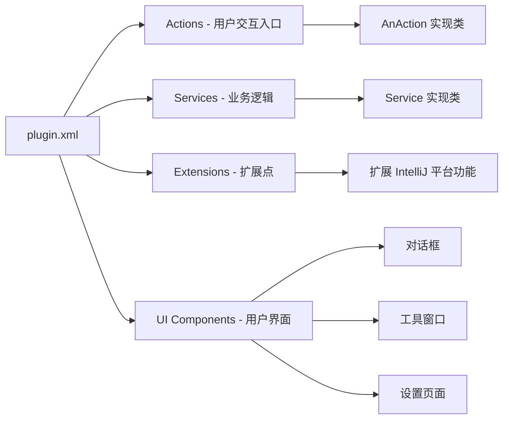

## 3. RuoYi-Vue-Plus 模块生成器插件架构

本插件的主要目标是自动化创建 RuoYi-Vue-Plus 框架的模块，简化开发流程。

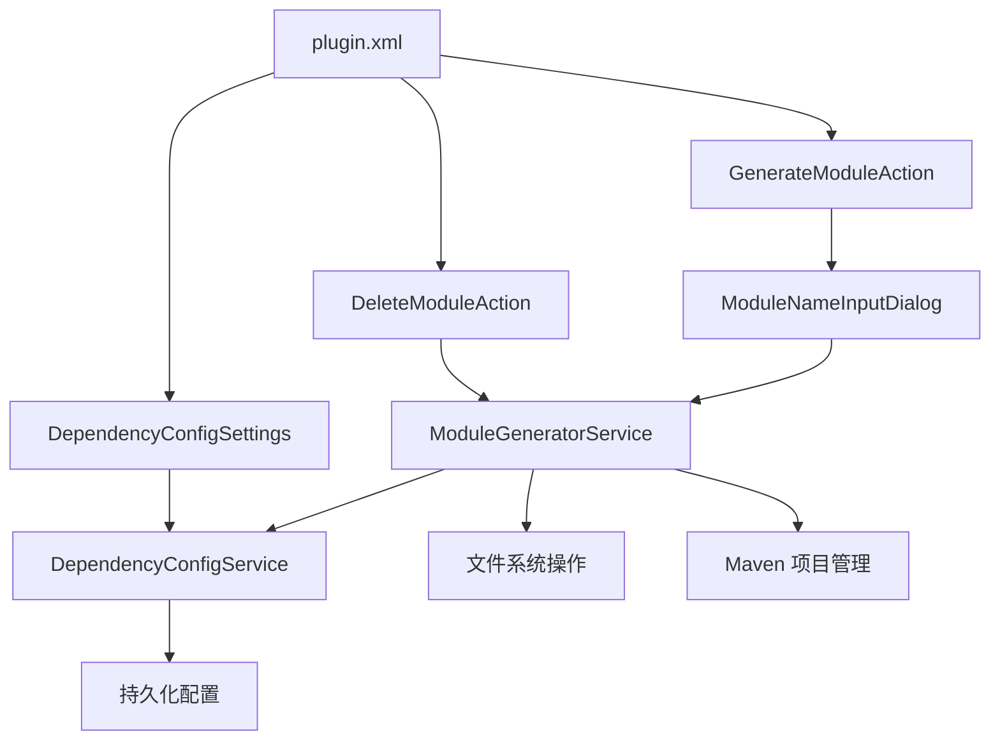

## 4. 插件开发关键技术点

### 4.1 Action 系统

Action 是用户与插件交互的入口点，通常通过菜单项、工具栏按钮或快捷键触发。

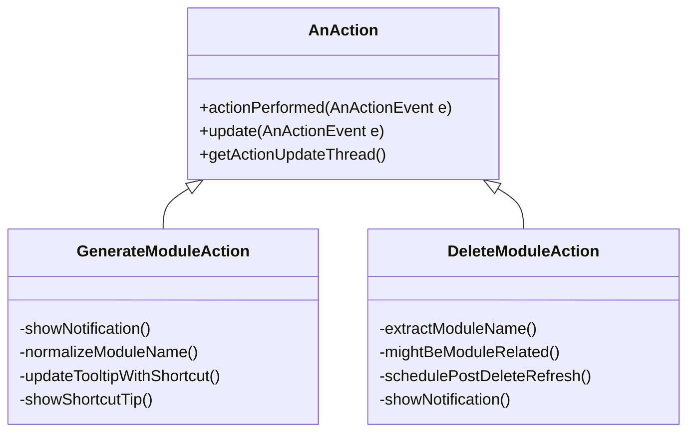

关键点：
- `actionPerformed` 方法：当用户触发操作时执行
- `update` 方法：动态控制操作的可见性和可用性
- `getActionUpdateThread`：控制 update 方法的执行线程
- 快捷键支持：通过 `keymap` 配置提供快捷键（如 Alt+Q）
- 上下文感知：根据选中项动态调整操作行为

### 4.2 Service 系统

Service 用于封装业务逻辑，有两种级别：
- Application 级：全局单例，跨项目共享
- Project 级：每个项目一个实例

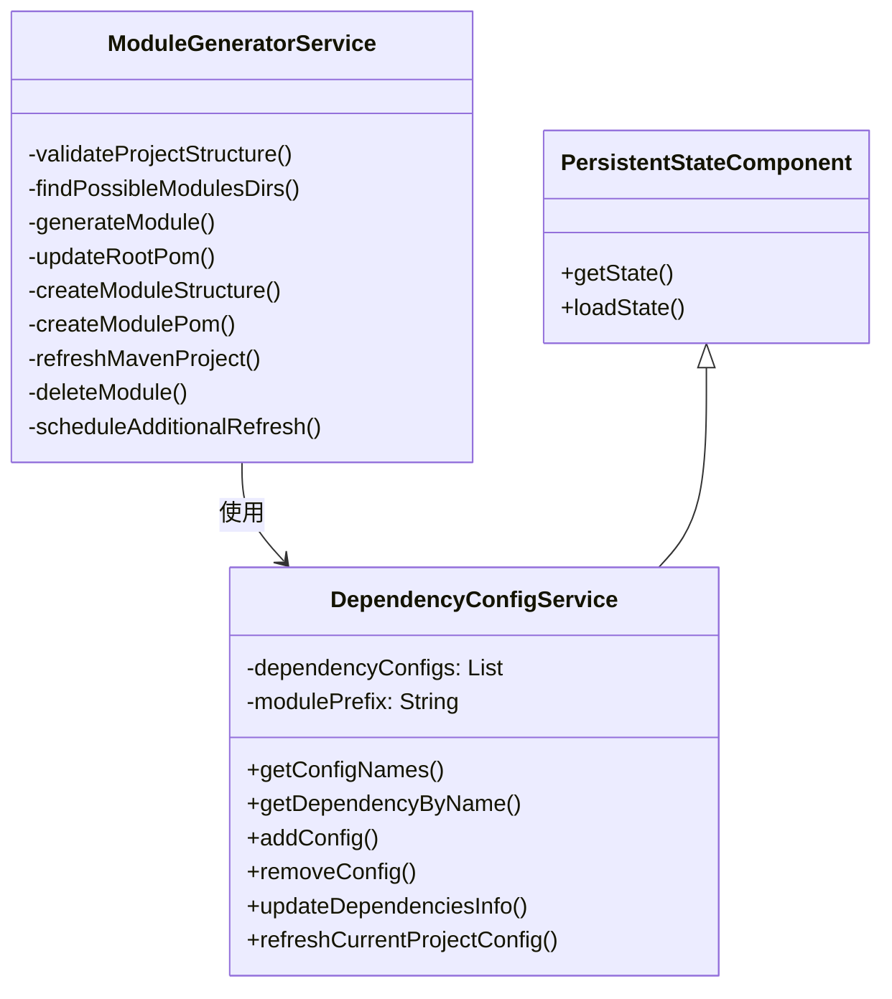

关键点：
- `@Service` 注解：声明服务级别
- `PersistentStateComponent`：支持配置持久化
- 服务注册：在 plugin.xml 中注册或通过代码获取 `project.service<ServiceClass>()`
- 跨项目配置：确保在多项目环境中正确识别项目特定的配置

### 4.3 UI 组件开发

IDEA 插件开发中的 UI 组件主要包括对话框、工具窗口和设置页面。

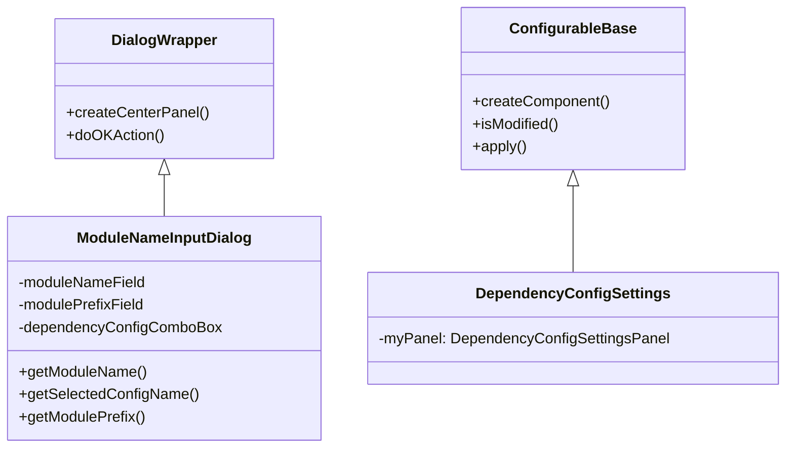

关键点：
- `DialogWrapper`：对话框基类，提供标准对话框布局和行为
- `ConfigurableBase`：设置页面基类，用于创建插件设置 UI
- Swing/JB UI 组件：使用 IntelliJ 提供的 UI 组件以保持一致的外观和体验
- 线程安全：确保在 EDT 线程中初始化和操作 UI 组件

### 4.4 文件和 PSI 操作

插件开发中经常需要读取和修改文件，IDEA 提供了 VFS（虚拟文件系统）和 PSI（程序结构接口）来处理这些操作。

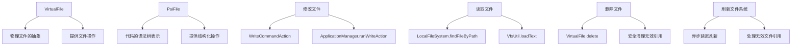

关键点：
- `VirtualFile`：表示文件系统中的文件，提供基本的文件操作
- `PsiFile`：表示代码文件的结构化表示，便于分析和修改
- `WriteCommandAction`：在可撤销的命令中执行写操作
- `ApplicationManager.runWriteAction`：在写操作中修改模型
- 延迟刷新：使用 `AppExecutorUtil` 安排延迟任务，避免并发修改异常
- 无效文件处理：处理删除后可能出现的无效文件引用

### 4.5 Maven 项目管理

本插件与 Maven 项目集成，需要了解如何操作 Maven 项目模型。

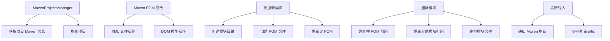

关键点：
- `MavenProjectsManager`：管理项目的 Maven 模型
- POM 文件修改：通常通过 XML 操作实现
- Maven 项目刷新：在修改后需要刷新以应用更改
- 删除模块：处理所有相关引用，确保项目结构一致性

## 5. 插件开发生命周期

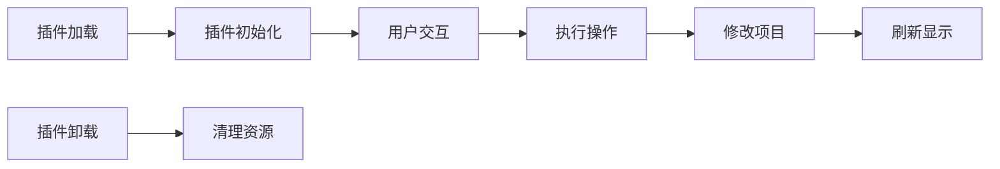

关键点：
- 插件加载：在 IDEA 启动或插件安装后进行
- 插件初始化：创建服务实例，注册监听器
- 用户交互：通过 Action 系统接收用户输入
- 执行操作：在后台或 EDT 线程中执行业务逻辑
- 修改项目：在写操作中修改项目文件
- 刷新显示：通知 IDE 更新 UI 显示

## 6. 插件打包与发布

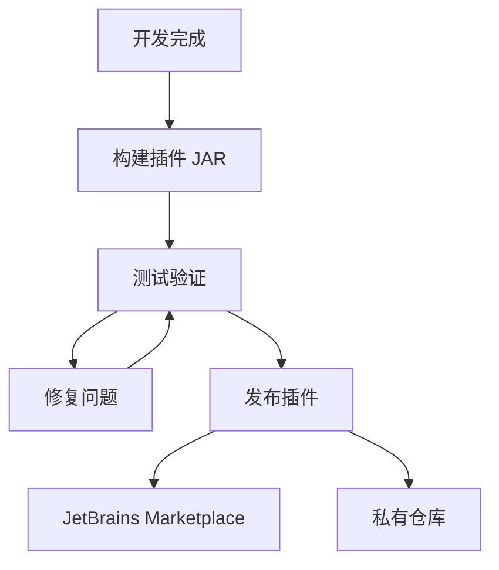

关键点：
- Gradle 构建：使用 gradle-intellij-plugin 构建插件
- 插件描述：在 plugin.xml 中提供完整的插件信息
- 版本控制：使用语义化版本控制插件版本
- 发布渠道：可以发布到 JetBrains Marketplace 或私有仓库
- 平台兼容性：确保兼容目标 IDEA 版本（当前为 2024.1+）

## 7. 最佳实践

- 遵循 IntelliJ 平台设计原则和 UI 指南
- 使用后台任务处理耗时操作
- 保持向后兼容性
- 提供完善的错误处理和用户反馈
- 考虑不同 IDE 版本和多平台支持
- 编写单元测试和集成测试
- 使用 Kotlin 语言可以简化代码并提高开发效率
- 确保在 EDT 线程中进行 UI 操作
- 在写操作后安排适当的刷新任务

## 8. 本插件关键流程

### 8.1 模块生成流程

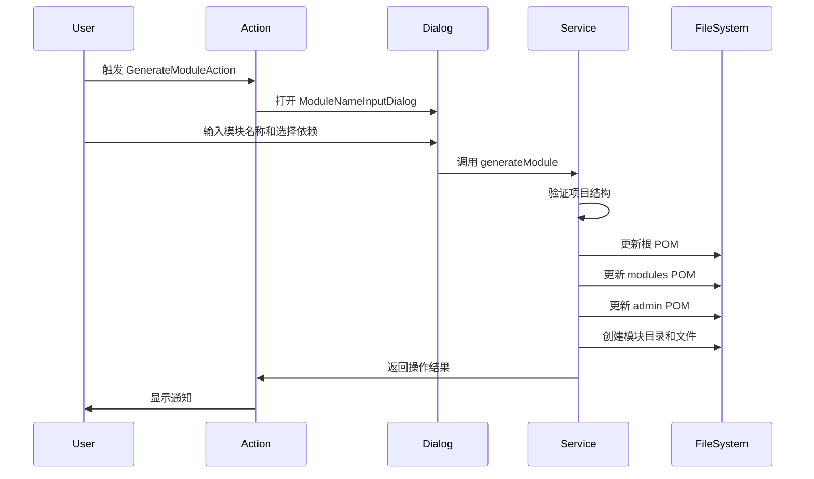

### 8.2 模块删除流程

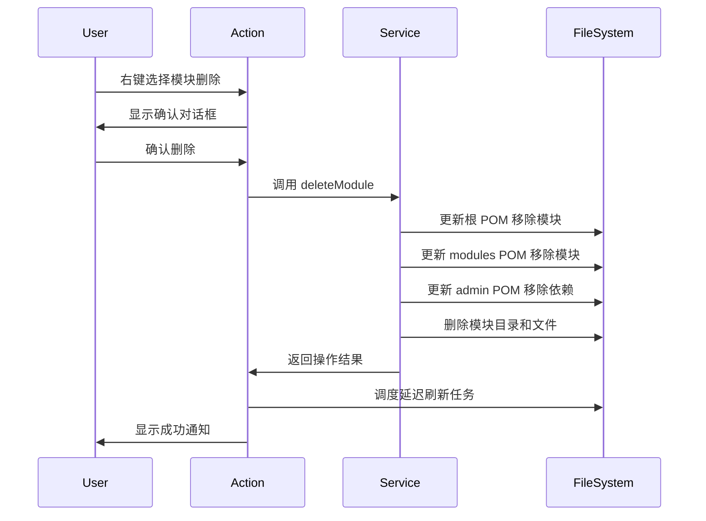

## 总结

IDEA 插件开发是一个强大的工具，可以极大地提高开发效率。本项目是一个优秀的示例，展示了如何创建实用的 IDEA 插件来简化特定框架的开发流程。通过学习和理解这些知识点，可以更好地开发自己的 IDEA 插件，或者为现有插件做出贡献。

本插件特别展示了如何：
1. 创建完善的用户交互体验（快捷键、提示消息）
2. 处理复杂的文件系统操作（创建、修改、删除）
3. 在删除操作后安全处理文件系统刷新和无效引用清理
4. 提供灵活的配置系统，适应不同的项目结构
5. 优雅处理异常和错误情况，提供清晰的反馈
